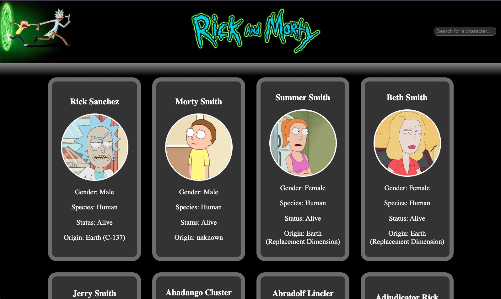
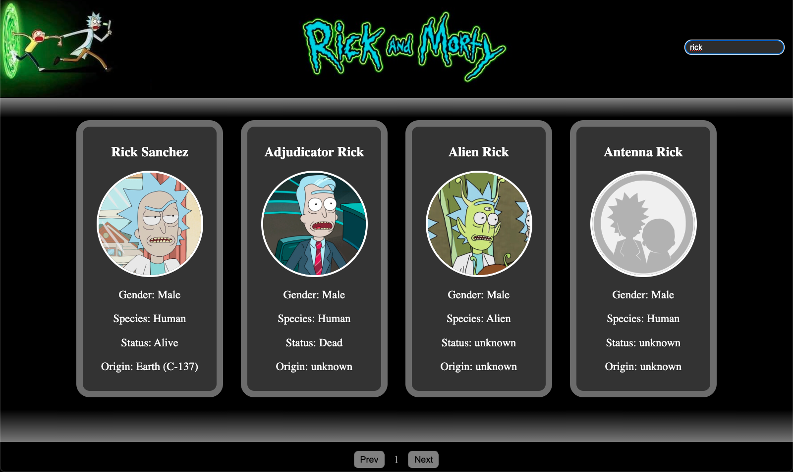

# Rick and Morty App

## Descripción

Esta es una aplicación web que consume la API de Rick and Morty para mostrar personajes, episodios y ubicaciones. La aplicación permite realizar búsquedas dinámicas y cuenta con paginación para navegar a través de los personajes disponibles.

## Características

- **Búsqueda dinámica:** Encuentra personajes rápidamente utilizando la barra de búsqueda.
- **Paginación:** Navega fácilmente entre los diferentes personajes.
- **Interfaz amigable:** Diseño sencillo e intuitivo.

## Tecnologías utilizadas

- **React.js**: Biblioteca de JavaScript para construir interfaces de usuario.
- **Fetch**: Para realizar solicitudes HTTP a la API.
- **CSS**: Para el diseño de la aplicación.

